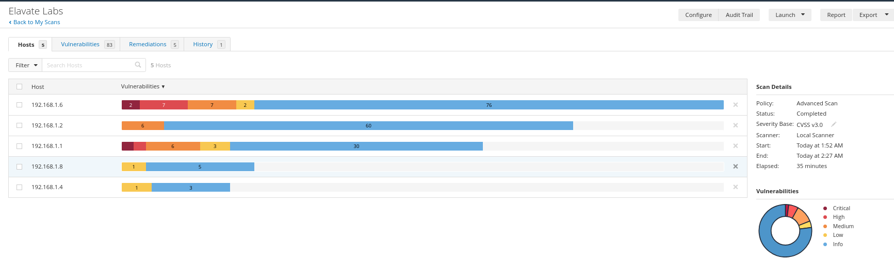

# 🔍 Network Vulnerability Assessment - Internship Task

This repository contains the findings from a vulnerability assessment conducted during a one-day cybersecurity internship. The scan was performed using **Nessus Essentials**, focusing only on **Critical** and **High** vulnerabilities.

---

## 🖥️ Targeted IP Addresses

| IP Address     | Role         | Vulnerability Types Found         |
|----------------|--------------|-----------------------------------|
| 192.168.1.6    | Kali Linux   | ✅ Critical, ✅ High               |
| 192.168.1.1    | Router       | ✅ Critical, ✅ High               |
| 192.168.1.2    | Other Device | ⚠️ Medium only (not analyzed)     |

---

## 📌 Project Scope

- ✅ Focused only on **Critical** and **High** severity vulnerabilities.
- ⏳ Skipped in-depth analysis of Medium/Low due to one-day project limit.
- ⚠️ Passive scan only — no exploitation performed.

---

## 📷 Nessus Scan Screenshot

Here is the Nessus scan dashboard showing the scan completion:




---

## 🛠️ How to Install Nessus on Kali Linux

1. **Download Nessus** from the official website:
   https://www.tenable.com/products/nessus/nessus-essentials

2. **Install the package:**
   ```bash
   sudo dpkg -i Nessus-<version>-debian6_amd64.deb
   sudo apt --fix-broken install

3. Open browser and navigate to: https://localhost:8834
4. Complete the setup:
   - Create a user
   - Choose Nessus Essentials
   - Register with your email to get a free activation code
   - Start scanning once setup completes.
